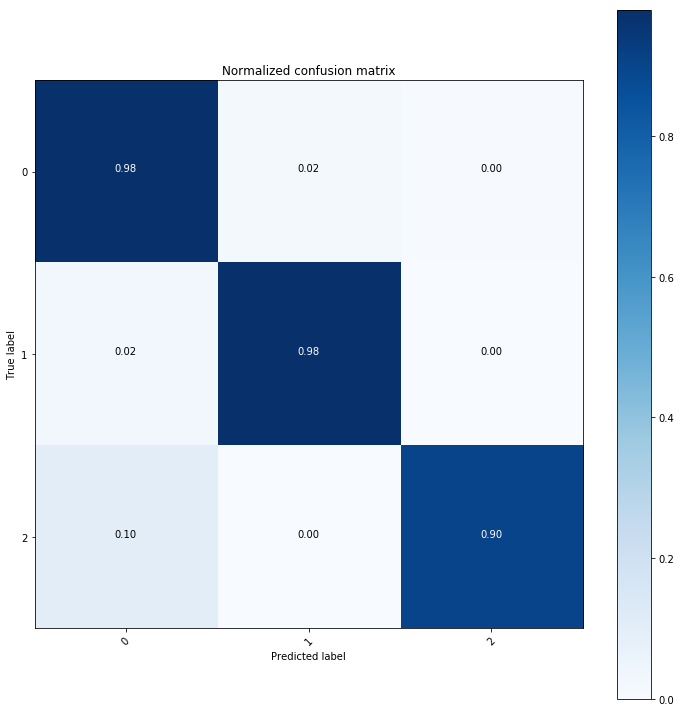
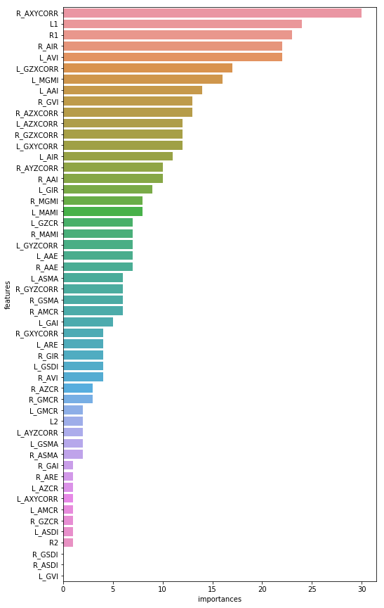
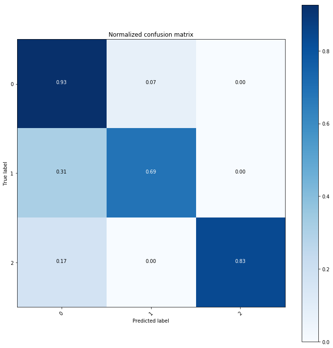
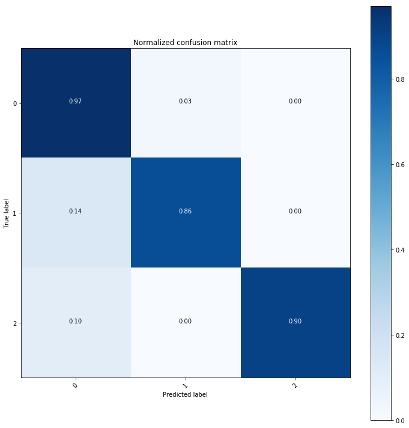
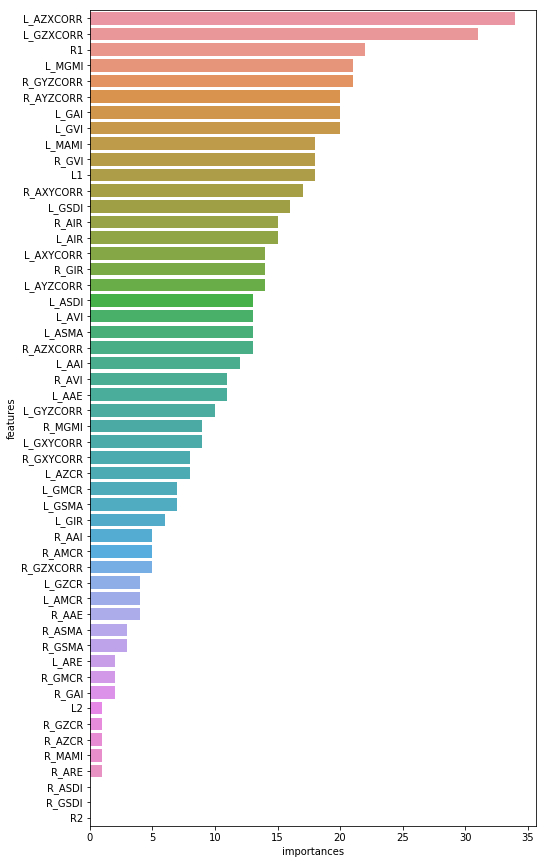
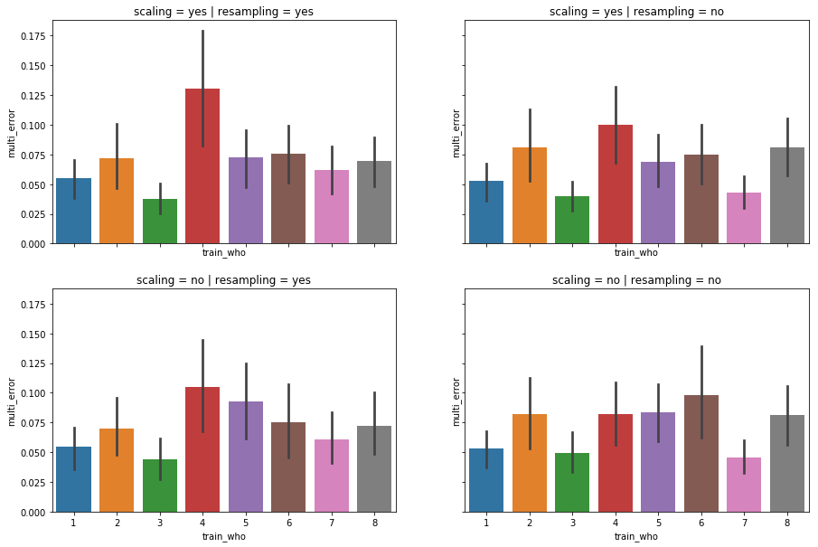
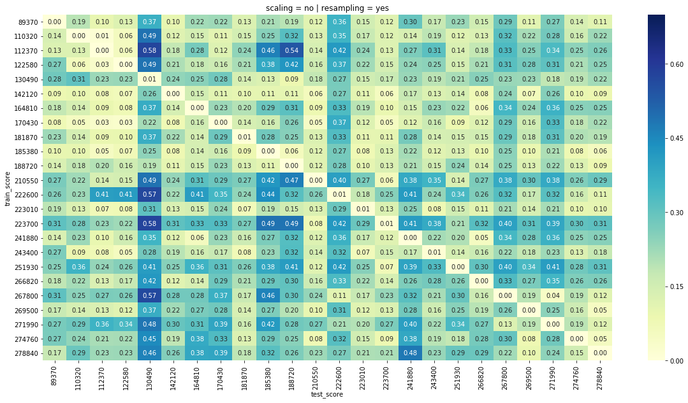
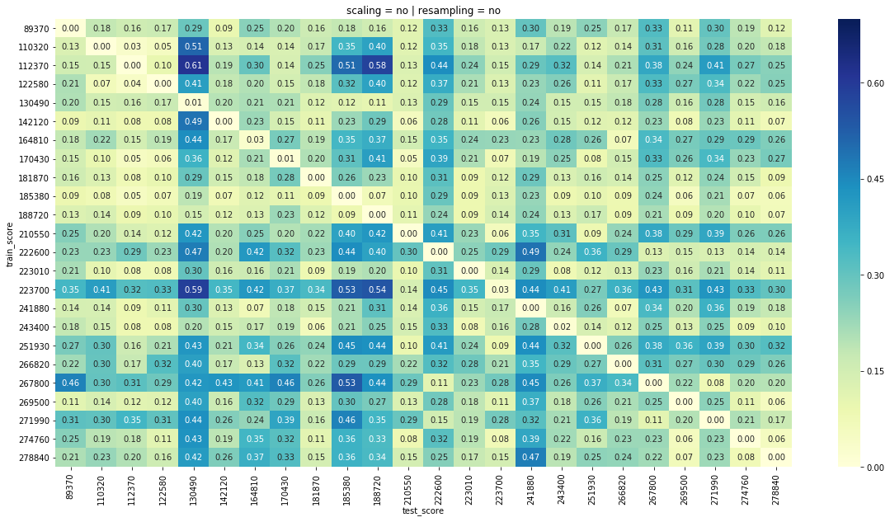

# Taiko-Master

This is a project teaching a newbie how to perform better in the video game [**Taiko no Tatsujin**](https://en.wikipedia.org/wiki/Taiko_no_Tatsujin).

 

## Flowchart
In general, follow the paper [Motion Primitive-Based Human Activity Recognition Using a Bag-of-Features Approach](https://dl.acm.org/citation.cfm?id=2110433).

 

## Preview

### Collect Data

Belows are repos for collecting raw data from wearable devices.

1. [beagle_bone_blue_data_acq](https://github.com/taoyilee/beagle_bone_blue_data_acq)

	- [Introduction of beaglebone-blue](docs/144934_data.pdf): The official manual of BBB.

	- [MPU9250A registration](docs/RM-MPU-9250A-00-v1.6.pdf): The register map and description of MPU-9250

2. [USB-Video-Class-Capture](https://github.com/taoyilee/USB-Video-Class-Capture)

 

### Singal anaimation

Belows two animations are some extraced features with the specific entire play, and we plot vertical color lines to represent real true hit event. 

 

### Event schematic diagram

We can interpret the local event as the following figure.

 

## Experiment
The followings are all about the song **夢をかなえてドラえもん**.

 

### Classfication

| hit event | hit event type  | origin hit type |
|----------|:-------------:|------:|
| *no* | 0 | 0 |
| *single* | 1 | 1, 2, 3, 4 |
| *stream* | 2 | 5, 6 |

 

### Model

1. [CNN](util/screenshot_model_generator.ipynb): train the score prediction model.

2. [LGBM](util/doraemon_LGBM.ipynb): train the hit type classification model.

 

### Observation

More observation can be checked at the following notebooks.

1. [Score Vis](util/score_visualization.ipynb): show all plays' score distributions.

2. [Simple Analysis](util/doraemon_analysis.ipynb): briefly visualize training error for all drummers

3. [Confusion Matrix](util/cm_test.ipynb): use model to predict other performance.

In addition, [Taiko-Time-Series-Analytics](https://github.com/taoyilee/Taiko-Time-Series-Analytics) is another related repo analyzing this data.

 

## Result

### Confusion Matrix

#### Case 1.

Using  **drummer 7**  's 3th play to train and testing 1st, 2nd plays, respectively, then we get

with the feature importance visualization 

#### Case 2.

Using  **drummer 4**  's 3th play to train and testing 1st, 2nd plays, respectively, then we get

with the feature importance visualization 

 

### Self-cross test

Use # to train and # to valid and then test #.

Resampling causes increasing training error. On the other hand, scaling causes decreasing one, in general.

 

### All-cross test

Scaling makes decreasing training error. But resampling has no fixed result.
