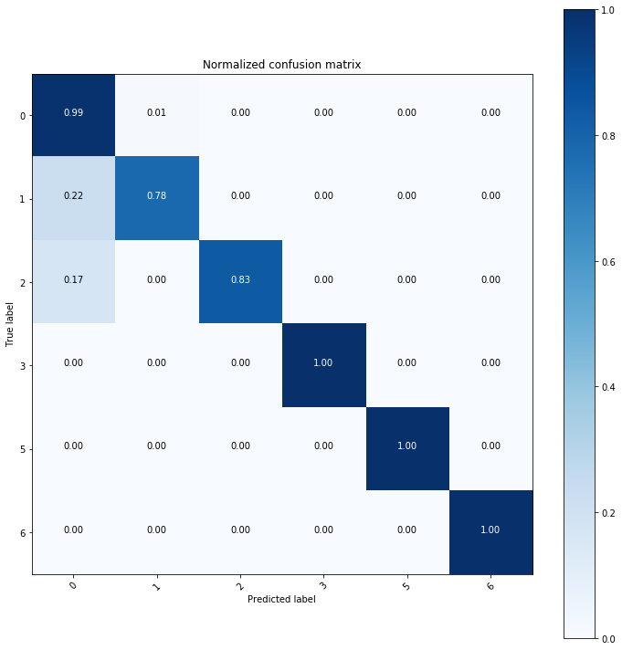
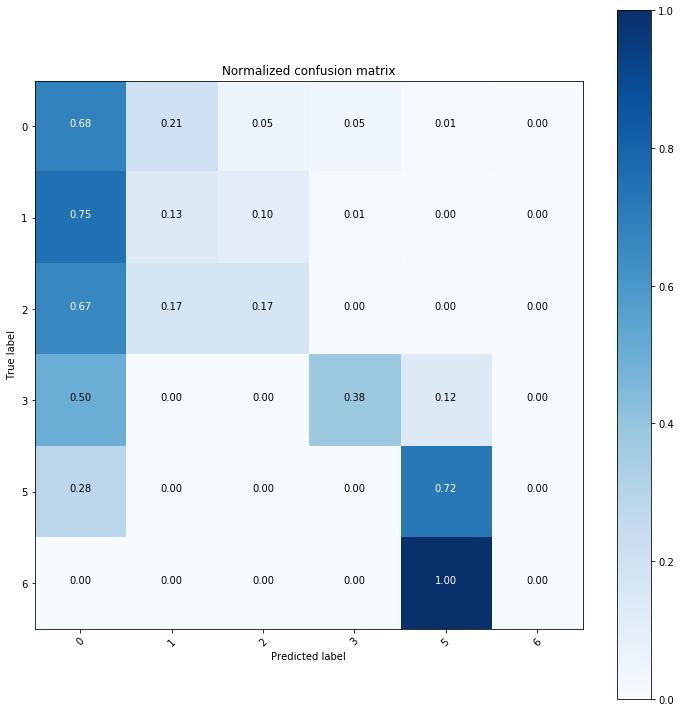

# Taiko-Master

This is a project teaching a newbie how to perform better in the video game [**Taiko no Tatsujin**](https://en.wikipedia.org/wiki/Taiko_no_Tatsujin).

 

## Flowchart
In general, follow the paper [Motion Primitive-Based Human Activity Recognition Using a Bag-of-Features Approach](docs/p631-zhang.pdf).

Belows are repos for collecting raw data from wearable devices.

1. [beagle_bone_blue_data_acq](https://github.com/taoyilee/beagle_bone_blue_data_acq)

	- [Introduction of beaglebone-blue](docs/144934_data.pdf): The official manual of BBB.

	- [MPU9250A registration](docs/RM-MPU-9250A-00-v1.6.pdf): The register map and description of MPU-9250

2. [USB-Video-Class-Capture](https://github.com/taoyilee/USB-Video-Class-Capture)

 

## Experiment
Belows two animations are some extraced features with the specific entire play, and we plot vertical color lines to represent real true hit event. 

We can interpret the local event as the following figure.

More observation can be checked at the following notebooks.

1. [EDA](util/taiko_feature_eda.ipynb): show the box plot of engineering features.
2. [BoF](util/taiko_BoF.ipynb): show the traning error about the bag-of-features model.
3. [Confusion Matrix](util/kernel_test.ipynb): use model to predict other performance.

In addtion, [Taiko-Time-Series-Analytics](https://github.com/taoyilee/Taiko-Time-Series-Analytics) is another related repo analyzing this data.

 

## Result
Use the last performance to train, we get

However, predict a test performance, we get

There is a long way to go! 
