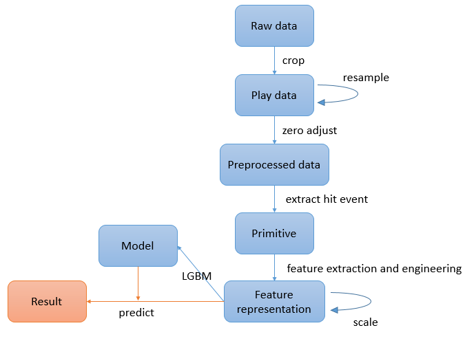
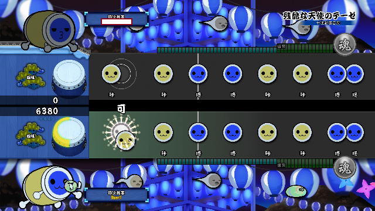
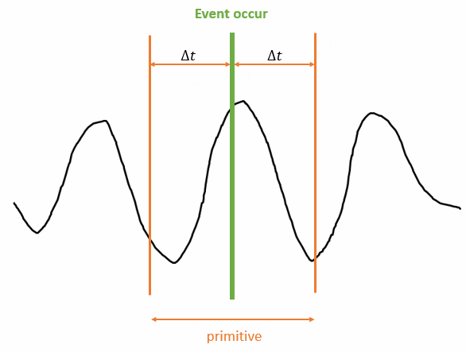
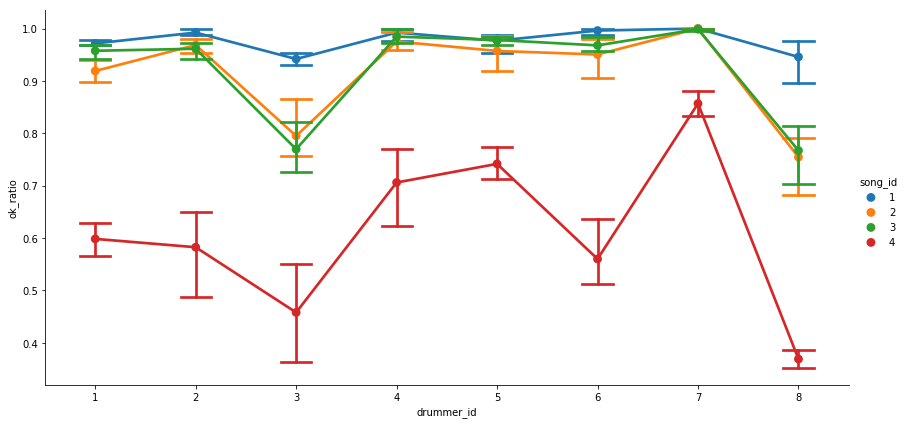
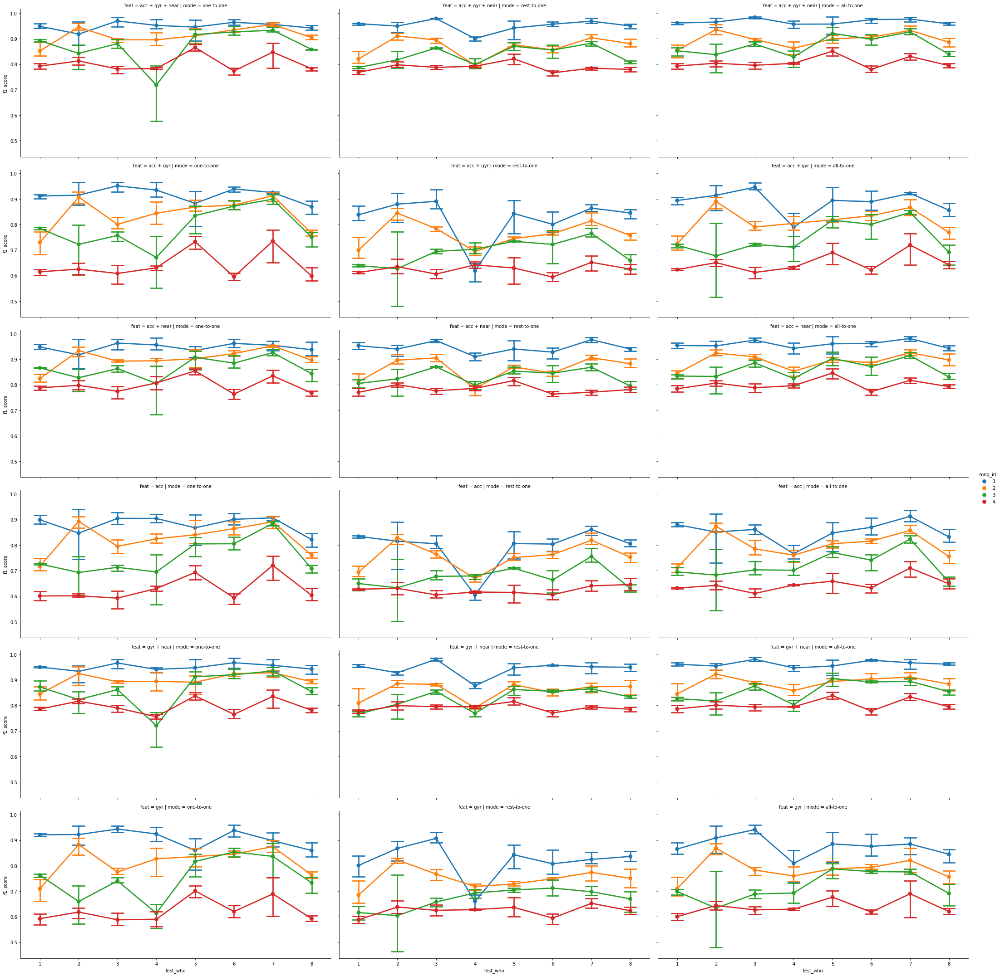
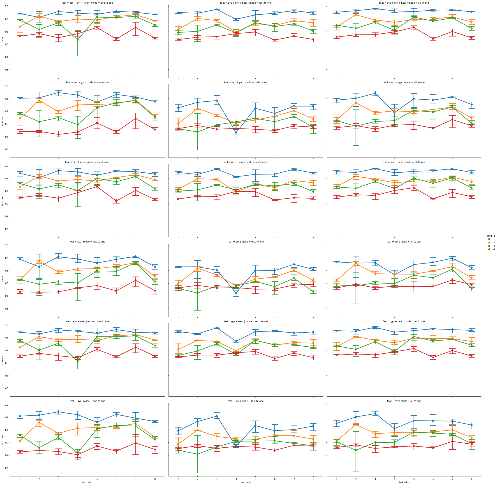
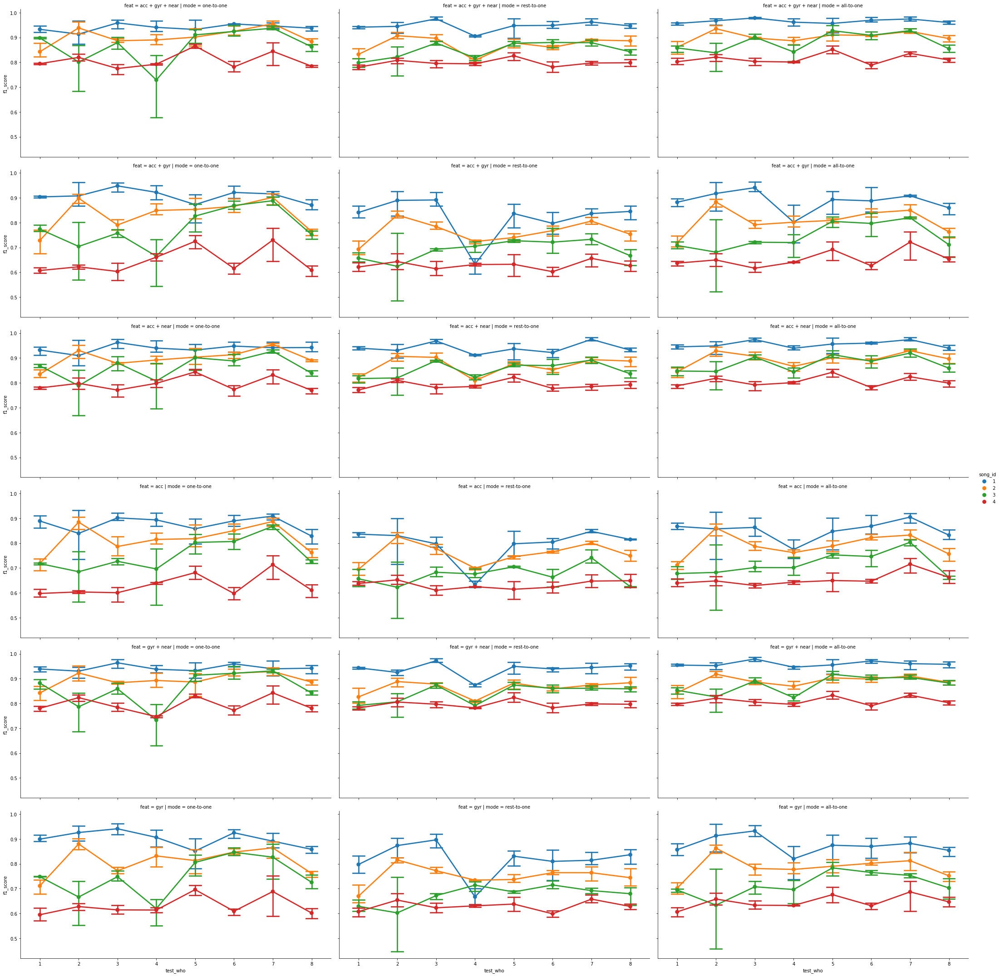

# Taiko-Master

This is a project teaching a newbie how to perform better in the video game [**Taiko no Tatsujin**](https://en.wikipedia.org/wiki/Taiko_no_Tatsujin).

 

## Flowchart

 

## Preview

### Collect Data

Belows are repos for collecting raw data from wearable devices.

1. [beagle_bone_blue_data_acq](https://github.com/taoyilee/beagle_bone_blue_data_acq)

	- [Introduction of beaglebone-blue](docs/144934_data.pdf): The official manual of BBB.

	- [MPU9250A registration](docs/RM-MPU-9250A-00-v1.6.pdf): The register map and description of MPU-9250

2. [USB-Video-Class-Capture](https://github.com/taoyilee/USB-Video-Class-Capture)

 

### Event

| hit type | hit desc  | picture |
|----------|:-------------:|------:|
| 0 | pause |  |
| 1 | dong_small |  |
| 2 | dong_big |  |
| 3 | ka_small |  |
| 4 | ka_big |  |
| 5 | stream_small |  |
| 6 | stream_big |  |
| 7 | stream_ship |  |

 

### Singal anaimation

Belows two animations are some extraced features with the specific entire play, and we plot vertical color lines to represent real true hit event. 

 

### Event schematic diagram

We can interpret the local event as the following figure.

 

## Experiment

ALL event primitives are resampled by **0.02s** sample rate.

ALL feature without correlation are scaled by *mean* = 0 and *std* = 1 for each feature.

**F1 score** is picked as the evalution of a model.

 

### Classfication

| group #         | bag 0 | bag 1 | bag 2 | bag 3 |
|-----------------|:-----:|------:|------:|-----:|
| single & stream |      |     |    | None |
| dong & ka       |      |  |   |    |
| small & big     |     |  |   |    |

 

### Model

1. [CNN](util/screenshot_model_generator.ipynb): train the score prediction model.

2. [LGBM](util/model_module_test.ipynb): train the hit type classification model.

 

### Observation

More observation can be checked at the following notebooks.

1. [Score Vis](util/score_visualization.ipynb): show all plays' score distributions.

2. [LGBM Analysis](util/lgbm_model_EDA.ipynb): briefly visualize training error for all drummers

3. [Confusion Matrix](util/cm_test.ipynb): use model to predict other performance.

4. [Result Screenshot Analysis](util/result_screenshot_info_EDA.ipynb): briefly visualize info extracted from result screen after playing.

In addition, [Taiko-Time-Series-Analytics](https://github.com/taoyilee/Taiko-Time-Series-Analytics) is another related repo analyzing this data.

 

### Feature selection parameter

| parameter         | description |
|-----------------|:-----:|
| acc | Use data collected from **accelerometer** |
| gyr | Use data collected from **gyroscope** |
| near | Use previous and next **hit type** from drum note |

 

### Scenario parameter

Suppose we have three subject *a,b,c* and they play the same song three times, respective.

Then *a1* means *a* play 1st time, *b3* means *b* plays 3rd time, and so on.

| parameter         | test set | train set |
|-----------------|:-----:|-----:|
| one-to-one | a1 | a2, a3 |
|   | b2 | b1, b3 |
| rest-to-one | a1 | b1, b2, b3, c1, c2, c3 |
|  | b2 | a1, a2, a3, c1, c2, c3 |
| all-to-one | a1 | a2, a3, b1, b2, b3, c1, c2, c3 |
|  | b2 | a1, a2, a3, b1, b3, c1, c2, c3 |

 

### Song

Links direct to Wiki.

| song id | name |
|-----------------|:-----:|
| 1 | [夢をかなえてドラえもん](http://www.wikihouse.com/taiko/index.php?%C6%F1%B0%D7%C5%D9%C9%BD%2F%A4%AB%A4%F3%A4%BF%A4%F3%2F%CC%B4%A4%F2%A4%AB%A4%CA%A4%A8%A4%C6%A5%C9%A5%E9%A4%A8%A4%E2%A4%F3) | 
| 2 | [ウィーアー！](http://www.wikihouse.com/taiko/index.php?%C6%F1%B0%D7%C5%D9%C9%BD%2F%A4%AB%A4%F3%A4%BF%A4%F3%2F%CC%B4%A4%F2%A4%AB%A4%CA%A4%A8%A4%C6%A5%C9%A5%E9%A4%A8%A4%E2%A4%F3) | 
| 3 | [六兆年と一夜物語](http://www.wikihouse.com/taiko/index.php?%C6%F1%B0%D7%C5%D9%C9%BD%2F%A4%AB%A4%F3%A4%BF%A4%F3%2F%CC%B4%A4%F2%A4%AB%A4%CA%A4%A8%A4%C6%A5%C9%A5%E9%A4%A8%A4%E2%A4%F3) | 
| 4 | [残酷な天使のテーゼ](http://www.wikihouse.com/taiko/index.php?%C6%F1%B0%D7%C5%D9%C9%BD%2F%A4%E0%A4%BA%A4%AB%A4%B7%A4%A4%2F%BB%C4%B9%F3%A4%CA%C5%B7%BB%C8%A4%CE%A5%C6%A1%BC%A5%BC) | 

Sorted by difficulty in ascending order.

* total = perfect + good + miss

* ok_ratio = (perfect + good) / total

 

## Result

### single & stream

 

### dong & ka

 

### big & small

 
